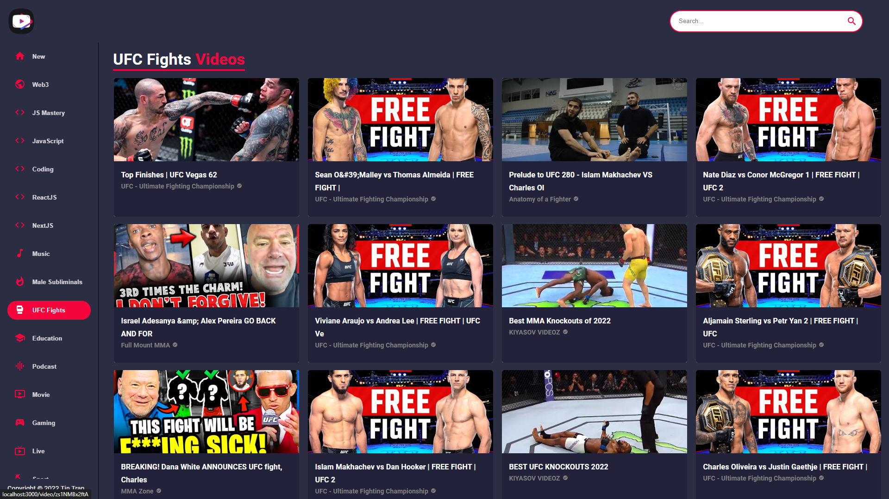

## Intro

- I've built and deloyed this project as a YouTube clone application in `React.js` using the newest version of `Material UI` and APIs.
- It has a stunning new video section, custom categories, channels, and video cards. Also channel pages, and importanly video pages where you can play video on the go from the app, see the relevant videos and much more.
- Prerequisite for building this project: `HTML`, `CSS`, and `JavaScript`.

## Topics Included
- React Functional Components
- React File & Folder Structure
- Material V5
- Responsive Media Queries
- RapidAPI's Usage
- Fetching Data w/ RapidAPI
- Usage of YouTube v3 API
- Axios Package
- Redux Routing DOM

